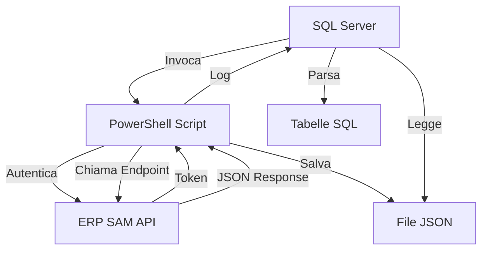

# 🚀 Soluzione API ERP SAM - SQL + PowerShell

## 📋 Panoramica

Questa soluzione risolve i **limiti di lunghezza** delle chiamate API da SQL Server, permettendo di gestire risposte JSON di **qualsiasi dimensione** da qualsiasi endpoint API.

## 🎯 Problema Risolto

- ❌ **Prima**: `VARCHAR(8000)` limitava le risposte API a 8000 caratteri
- ❌ **Prima**: `NVARCHAR(MAX)` non funziona con OLE Automation
- ✅ **Ora**: **Nessun limite** - PowerShell gestisce JSON di qualsiasi dimensione
- ✅ **Ora**: **Universale** - funziona con qualsiasi endpoint API

## 📁 File della Soluzione

| File | Descrizione |
|------|-------------|
| `ApiCaller.ps1` | Script PowerShell che gestisce le chiamate API |
| `Test Artico.sql` | Script SQL principale che invoca PowerShell |
| `ProcessJson.sql` | Esempio di lettura e parsing del JSON |
| `README.md` | Questa documentazione |

## 🛠️ Setup Iniziale

### 1️⃣ Abilita xp_cmdshell su SQL Server

```sql
-- Esegui come amministratore
EXEC sp_configure 'xp_cmdshell', 1;
RECONFIGURE;
```

### 2️⃣ Crea la cartella di lavoro

```cmd
mkdir C:\temp
```

### 3️⃣ Copia i file

- Posiziona `ApiCaller.ps1` in `C:\temp\ApiCaller.ps1`
- Esegui gli script SQL dal tuo ambiente

## 🚀 Utilizzo

### Opzione 1: Script Completo (Raccomandato)

```sql
-- Modifica l'endpoint nel file Test Artico.sql
DECLARE @Endpoint NVARCHAR(500) = '/api/v1/artico?pageno=1&pagesize=10';

-- Esegui Test Artico.sql
-- Otterrai:
-- 1. Chiamata API automatica
-- 2. File JSON salvato in C:\temp\api_response.json
-- 3. Log dettagliato del processo
```

### Opzione 2: Chiamate Dirette PowerShell

```powershell
# Solo token
powershell.exe -ExecutionPolicy Bypass -File "C:\temp\ApiCaller.ps1" -Action token

# Chiamata API completa
powershell.exe -ExecutionPolicy Bypass -File "C:\temp\ApiCaller.ps1" -Action full -Endpoint "/api/v1/clienti" -OutputFile "C:\temp\clienti.json"

# Solo API (con token esistente)
powershell.exe -ExecutionPolicy Bypass -File "C:\temp\ApiCaller.ps1" -Action api -Token "YOUR_TOKEN" -Endpoint "/api/v1/ordini" -OutputFile "C:\temp\ordini.json"
```

### Opzione 3: Lettura e Processing JSON

```sql
-- Esegui ProcessJson.sql dopo aver creato il file JSON
-- Otterrai:
-- 1. Lettura completa del JSON (qualsiasi dimensione)
-- 2. Parsing automatico degli articoli
-- 3. Inserimento in tabelle SQL
-- 4. Query di esempio
```

## 📊 Esempi di Endpoint

```sql
-- Articoli paginati
DECLARE @Endpoint NVARCHAR(500) = '/api/v1/artico?pageno=1&pagesize=50';

-- Singolo articolo
DECLARE @Endpoint NVARCHAR(500) = '/api/v1/artico/39568';

-- Clienti
DECLARE @Endpoint NVARCHAR(500) = '/api/v1/clienti?pageno=1&pagesize=20';

-- Ordini
DECLARE @Endpoint NVARCHAR(500) = '/api/v1/ordini?datada=2024-01-01&dataa=2024-12-31';
```

## 🔧 Configurazione Avanzata

### Modifica Server/Credenziali

Nel file `ApiCaller.ps1`, cambia i parametri di default:

```powershell
[string]$ServerUrl = "http://116.203.46.193:2000",
[string]$Username = "webapi",
[string]$Password = "webapi", 
[string]$CompanyId = "BO",
```

### Modifica Percorsi File

Nel file `Test Artico.sql`:

```sql
DECLARE @PowerShellScript NVARCHAR(500) = 'C:\temp\ApiCaller.ps1';
DECLARE @OutputFile NVARCHAR(500) = 'C:\temp\api_response.json';
```

## 🎯 Vantaggi della Soluzione

| Caratteristica | Beneficio |
|----------------|-----------|
| **🔄 Universale** | Funziona con QUALSIASI endpoint API |
| **📈 Scalabile** | Gestisce JSON da 1KB a 100MB+ |
| **🛡️ Robusto** | Gestione errori completa |
| **📊 Strutturato** | Output organizzato e leggibile |
| **🔧 Flessibile** | Facilmente configurabile |
| **⚡ Efficiente** | Una chiamata per ottenere tutti i dati |

## 🔄 Workflow Tipico



## 🚨 Troubleshooting

### Errore: "xp_cmdshell non abilitato"
```sql
EXEC sp_configure 'xp_cmdshell', 1;
RECONFIGURE;
```

### Errore: "Script PowerShell non trovato"
- Verifica che `ApiCaller.ps1` sia in `C:\temp\`
- Verifica i permessi di lettura del file

### Errore: "EMVCJWTException"
- Il token è scaduto
- Esegui di nuovo lo script per ottenere un token fresco

### Errore PowerShell ExecutionPolicy
```powershell
Set-ExecutionPolicy -ExecutionPolicy RemoteSigned -Scope CurrentUser
```

## 📈 Performance

- **Piccoli JSON (<10KB)**: ~1-2 secondi
- **Medi JSON (10-100KB)**: ~2-5 secondi  
- **Grandi JSON (>100KB)**: ~5-15 secondi

## 🔐 Sicurezza

- **Token**: Gestito automaticamente e sicuro
- **Credenziali**: Configurabili nel script PowerShell
- **File**: Salvati in cartella locale temporanea
- **Cleanup**: Opzionale per rimuovere file temporanei

## 🎉 Conclusione

Questa soluzione ti permette di:

1. **✅ Chiamare QUALSIASI API** dal tuo ERP SAM
2. **✅ Gestire risposte di QUALSIASI dimensione**
3. **✅ Processare JSON complessi** direttamente in SQL
4. **✅ Automatizzare import/export** di dati
5. **✅ Integrare sistemi** senza limiti tecnici

**🚀 Ora hai la libertà totale di integrare il tuo ERP SAM con qualsiasi sistema!** 